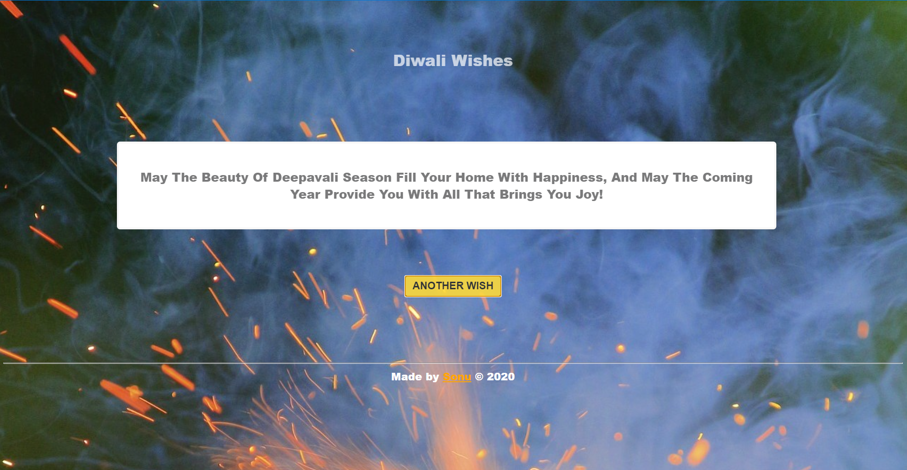

# Diwali-Wishes

      

## Download as a [Desktop App](https://drive.google.com/file/d/1sWmCKRoPd1cImhA5F_WrfiIm_CjaqkaU/view?usp=sharing)

##### Live Demo  [here](https://flyingsonu122.github.io/Diwali-Wishes/) 

## Want to contribute?

 

> Please check issues **[here](https://github.com/flyingsonu122/JSON/issues)**!

**[ISSUE [#1](https://github.com/flyingsonu122/JSON/issues/1)]** : **[Add More Diwali Wishes](https://github.com/flyingsonu122/JSON/issues/1)** (Recommended )

## License

  

**MIT &copy; [Sonu kumar kushwaha](https://github.com/flyingsonu122/Diwali-Wishes/blob/master/LICENSE)**

## Thanks!

Thank you for being here! You can find my other project **[here](https://github.com/flyingsonu122?tab=repositories)**.

 

  

 Let's have a chat on 
 

	
	
	
	
	
	
	
	
	
	

